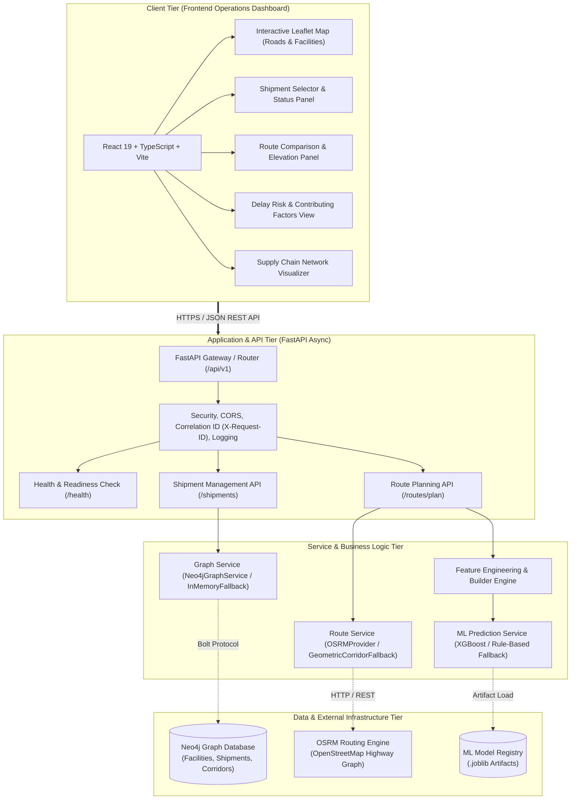
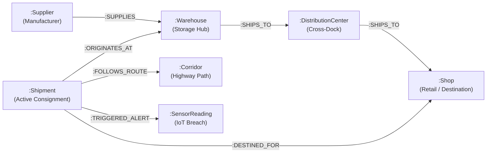
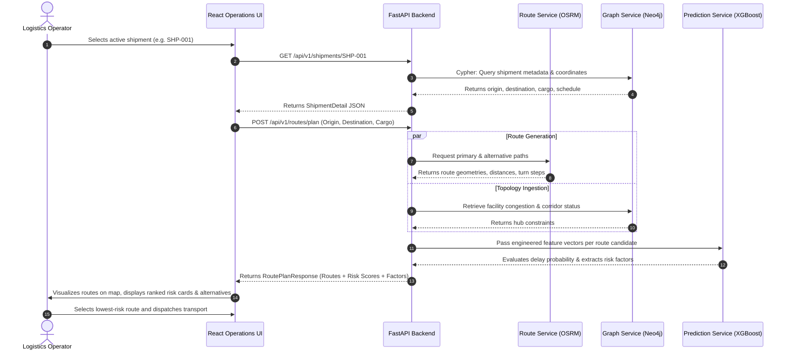

# MeetMux: Supply Chain Shipment Delay Risk & Route Planning System
## Comprehensive System & Architecture Documentation

---

## 1. Executive Summary

**MeetMux** is an enterprise-grade supply chain intelligence platform designed to transition logistics operations from **reactive tracking** to **proactive, risk-aware route planning**. By combining **Graph Database topology (Neo4j)**, **Open-Source Road Routing (OSRM)**, and **Explainable Machine Learning (XGBoost)**, MeetMux provides logistics dispatchers and operations teams with real-time visibility into multi-echelon shipment networks, predictive delay risk probabilities (>30-minute threshold), and transparent, human-auditable risk factors across alternative road corridors.

---

## 2. Problem Statement

### 2.1 The Industry Challenge
Global and domestic supply chains operate under tight delivery windows. A single delay at an upstream manufacturing facility or transit corridor creates cascading disruptions across distribution centers, assembly plants, and retail storefronts:
- **Financial Toll**: Unplanned logistics delays cost enterprises billions annually in detention fees, expedited freight premiums, and production downtime.
- **Customer Impact**: Stockouts and missed service-level agreements (SLAs) jeopardize customer trust and commercial contracts.
- **Complex Topologies**: Modern supply chains are not linear pipelines; they are interconnected networks where a disruption at one hub impacts multiple downstream delivery routes.

### 2.2 Key Gaps in Existing Solutions
Current commercial Transportation Management Systems (TMS) and fleet telematics suffer from three systemic shortcomings:

1. **Purely Reactive Tracking**: Traditional GPS trackers show *where a shipment is right now*, but cannot reliably forecast whether a shipment scheduled to depart or currently in transit will arrive late.
2. **Black-Box ETAs & Lack of Explainability**: Standard GPS routing engines compute static distance/speed ETAs that disregard supply-chain-specific risk variables (e.g., cargo type vulnerability, driver dwell time, multi-stop facility dwell times, historical corridor congestion). When machine learning models are introduced, they often output opaque risk scores without attributing *why* a shipment is at risk.
3. **Disjointed Network Visibility**: Traditional relational databases (SQL) model shipments as flat tables. They struggle to run multi-hop graph queries (e.g., *"If Warehouse B is delayed, which downstream retail shops and connected shipments will face stockouts?"*) without slow, compute-intensive recursive joins.

---

## 3. Proposed Solution

MeetMux resolves these challenges through a unified, predictive operations platform:

### 3.1 Core Pillars of the Solution

```
┌─────────────────────────────────────────────────────────────────────────────┐
│                             MEETMUX SOLUTION                                │
├─────────────────────────┬─────────────────────────┬─────────────────────────┤
│    GRAPH TOPOLOGY       │    MULTI-CORRIDOR       │    TRANSPARENT RISK     │
│       (Neo4j)           │    ROUTING (OSRM)       │    ENGINE (XGBoost)     │
├─────────────────────────┼─────────────────────────┼─────────────────────────┤
│ Maps interconnected     │ Computes primary and    │ Predicts binary delay   │
│ suppliers, warehouses,  │ alternative road paths, │ probability (>30 min)   │
│ distribution centers,   │ transit times, and      │ with ranked, human-     │
│ and retail shops.       │ waypoints dynamically.  │ readable risk factors.  │
└─────────────────────────┴─────────────────────────┴─────────────────────────┘
```

1. **Network-Aware Graph Engine**: Employs Neo4j to model the supply chain as a graph of physical facilities (`:Location`, `:Supplier`, `:Warehouse`, `:DistributionCenter`, `:Shop`), transport corridors, and shipments, enabling sub-50ms topological queries.
2. **Alternative Corridor Route Planning**: Leverages OSRM road networks to evaluate multiple physical routes between origin and destination, comparing distance, duration, and historical risk exposure.
3. **Transparent Delay-Risk Prediction**: Uses an XGBoost binary classifier to predict whether a shipment will breach its SLA by more than 30 minutes, accompanying every prediction with structured contributing factors (e.g., *"High transit distance: 1,380 km"*, *"Heavy corridor congestion index"*, *"Cargo temperature breach"*).
4. **Data Integrity & Fallback Transparency**: Clearly distinguishes between certified machine learning inferences (`model_prediction`) and heuristic rule-based baselines (`fallback_estimate`), eliminating false confidence in demo or disconnected states.
5. **Real-Time Operator Dashboard**: A dark-mode operational UI built with React 19, TypeScript, and Leaflet, offering interactive road maps, network dependency visualization, shipment selectors, and side-by-side route comparisons.

---

## 4. System Architecture

### 4.1 High-Level Architecture Diagram



---

### 4.2 Component Breakdown

| Tier | Component | Technology | Responsibility |
|---|---|---|---|
| **Frontend** | Operations Dashboard | React 19, TypeScript, Vite, Vanilla CSS | Interactive operations view, shipment filtering, path drawing, and SLA risk rendering. |
| **Frontend** | Geospatial Visualizer | Leaflet, OpenStreetMap Tiles | Renders origin/destination markers, transit corridors, intermediate waypoints, and disruption highlights. |
| **Backend** | API Gateway | FastAPI, Pydantic v2, Uvicorn | Async HTTP request handling, input schema validation, request tracing via `X-Request-ID`, and health probes. |
| **Backend** | Middleware Stack | Starlette CORSMiddleware, Custom Handlers | Enforces strict CORS origins, injects security headers (`X-Content-Type-Options`, `X-Frame-Options`), and tracks latency. |
| **Services** | Graph Service | Neo4j Python Async Driver | Executes Cypher queries across topological nodes; falls back to `InMemoryGraphService` for zero-dependency operation. |
| **Services** | Route Planning Engine | HTTPX Async, OSRM API | Calculates real-world polyline corridors, step-by-step turn directions, and segment durations. |
| **Services** | Feature Builder | Python, NumPy, Pandas | Assembles dynamic inference vectors combining corridor distance, cargo type, temporal parameters, and facility status. |
| **Services** | Prediction Service | Scikit-learn, XGBoost, Joblib | Evaluates binary delay risk, calibrates probability output, and formats human-readable contributing factors. |

---

## 5. Data & Graph Model Specification

### 5.1 Graph Schema (Neo4j)

The multi-echelon network is modeled as a connected property graph:



### 5.2 Key Node Properties & Definitions

- **`:Location`**: Base node with physical geographic coordinates (`lat`, `lon`), name, address, and facility type (`Supplier`, `Warehouse`, `DistributionCenter`, `Shop`, `Port`).
- **`:Shipment`**: Physical freight package carrying payload metadata (`cargo_type`, `weight_kg`, `status`, `planned_delivery`, `origin_id`, `destination_id`).
- **`:SensorReading`**: Cold-chain telemetry pings (temperature, vibration, moisture) flagged when exceeding safety thresholds.
- **`:Corridor`**: Road transport segments connecting regional logistics nodes with historical transit times and toll counts.

---

## 6. Machine Learning Delay-Risk Engine

### 6.1 Formulation & Objective
- **Target Variable**: Binary classification $y \in \{0, 1\}$, where $y = 1$ if $\text{delay\_minutes} > 30$, and $0$ otherwise.
- **Evaluation Timing**: Inferred prior to departure (at dispatch route selection) or dynamically upon corridor rerouting.

### 6.2 Feature Pipeline
The feature builder aggregates four categories of predictors:

```
┌────────────────────────────────────────────────────────────────────────┐
│                        FEATURE VECTOR INGESTION                        │
├────────────────────┬────────────────────┬──────────────────────────────┤
│ SPATIAL & ROUTE    │ CARGO & ASSET      │ TEMPORAL & ENVIRONMENT       │
├────────────────────┼────────────────────┼──────────────────────────────┤
│ • Corridor distance│ • Cargo category   │ • Departure hour of day      │
│ • Highway ratio    │ • Payload weight   │ • Day of week                │
│ • Waypoint density │ • Refrigerated flag│ • Seasonal weather index     │
│ • Urban crawl pct  │ • Vehicle class    │ • Historical hub dwell time  │
└────────────────────┴────────────────────┴──────────────────────────────┘
```

### 6.3 Explainable Contributing Factors
Rather than displaying a raw, uninterpretable probability (e.g. `0.78`), the system derives human-readable risk drivers:
- **Corridor Distance Driver**: Flagged when total haul distance exceeds historical median for cargo class.
- **Congestion Index**: Flagged when the route traverses known urban chokepoints during peak hours.
- **Cold-Chain Alert**: Flagged if IoT telemetry registers temperature excursions above permissible thresholds.

---

## 7. End-to-End Operational Workflow



---

## 8. Deployment & Cloud Architecture

The platform is deployed in a cloud-native configuration on **Render**:

```
                       User / Dispatcher Web Browser
                                     │
                                     ▼ (HTTPS)
                      ┌─────────────────────────────┐
                      │    Render Cloud Platform    │
                      └──────────────┬──────────────┘
                                     │
                     ┌───────────────┴───────────────┐
                     ▼                               ▼
       ┌───────────────────────────┐   ┌───────────────────────────┐
       │   meetmux-frontend        │   │   meetmux-backend         │
       │   (React Static Site)     │   │   (FastAPI Web Service)   │
       │   URL: meetmux-frontend   │   │   URL: meetmux-backend    │
       │   .onrender.com           │   │   .onrender.com           │
       └─────────────┬─────────────┘   └─────────────┬─────────────┘
                     │                               │
                     └──────── REST API Calls ───────┘
                                     │
                     ┌───────────────┴───────────────┐
                     ▼                               ▼
       ┌───────────────────────────┐   ┌───────────────────────────┐
       │   In-Memory Demo Graph /  │   │   Pretrained XGBoost      │
       │   Neo4j AuraDB (Optional) │   │   Model (.joblib)         │
       └───────────────────────────┘   └───────────────────────────┘
```

- **Frontend**: Hosted on Render Static Sites with automatic single-page application (SPA) rewrite rules and edge distribution.
- **Backend**: Hosted on Render Web Services (Python 3.12, Uvicorn async worker) with automated health check monitoring at `/api/v1/health`.
- **Zero-Dependency Resilience**: The backend seamlessly falls back to an in-memory graph repository and mock router when external managed services (Neo4j Aura or local OSRM) are offline.

---

## 9. Conclusion & Impact

MeetMux transforms supply-chain route planning by marrying **graph relational depth** with **machine learning foresight**. By identifying high-risk shipments *before* they depart and providing actionable, transparent contributing factors, logistics operations teams can proactively re-route freight, reschedule dock windows, and protect enterprise delivery SLAs.
